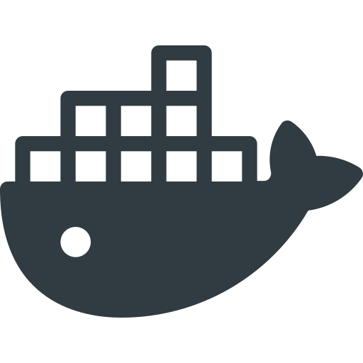
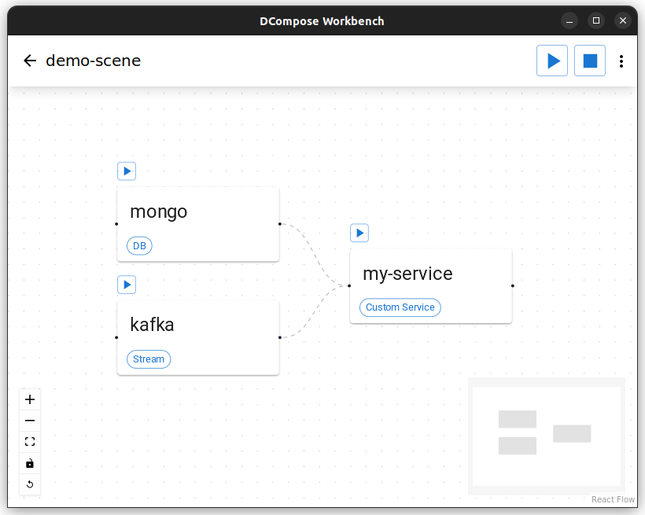

  
  <h3>DCompose Workbench</h3>
  

    Desktop application to manage your <code>docker-compose.yml</code> files easily
     
    <a href="https://github.com/ianFar96/dcompose-workbench/issues">Report Bug</a>
    ·
    <a href="https://github.com/ianFar96/dcompose-workbench/issues">Request Feature</a>
  

DCompose Workbench is a desktop app made to manage your <code>docker-compose.yml</code> files in a visual and organized way. 

## Getting Started

### Installation

To install DCompose Workbench you just need to head to the [Releases page](https://github.com/ianFar96/dcompose-workbench/releases) and download the most recent one.

Note that the app is not signed for macOS, so a warning of some sort may appear when installing or opening.
To bypass this you can check out [this guide](https://support.apple.com/en-gb/guide/mac-help/mh40616/mac)

### Usage

To start using the app you need to create a **Scene**. A Scene is nothing more than a folder with a `docker-compose.yml` file in it, located at the app's config folder `${HOME}/.dcompose-workbench`. If you wish, you can edit the whole `docker-compose.yml` file by using the "Open on VS Code" action in the top right corner menu. This makes it easier if you want to copy/paste already made docker compose files into the app.

### Features

- Create/edit/delete service
- Start/stop all or a single service
- Import/detach another scene (leveraging the `include` key)
- Follow service logs
- Follow service status (hover on the icon above the service)
- Import/copy assets so the service can use them as volumes of env
- Create/edit/delete dependencies between services (leveraging the `depends_on` key)

## Contributing

Contributions are what make the open source community such an amazing place to learn, inspire, and create. Any contributions you make are **greatly appreciated**.

If you have a suggestion that would make this better, please fork the repo and create a pull request. You can also simply open an issue with the tag "enhancement".
Don't forget to give the project a star! Thanks again!

1. Fork the Project
2. Create your Feature Branch (`git checkout -b feature/AmazingFeature`)
3. Commit your Changes (`git commit -m 'Add some AmazingFeature'`)
4. Push to the Branch (`git push origin feature/AmazingFeature`)
5. Open a Pull Request

## License

Distributed under the MIT License. See `LICENSE` for more information.

## Acknowledgments

<a href="https://mui.com/">MUI Design System</a>
 
<a href="https://reactflow.dev/">React Flow</a>
 
<a href="https://www.flaticon.com/free-icons/decomposition" title="decomposition icons">Decomposition icons created by Umeicon - Flaticon</a>